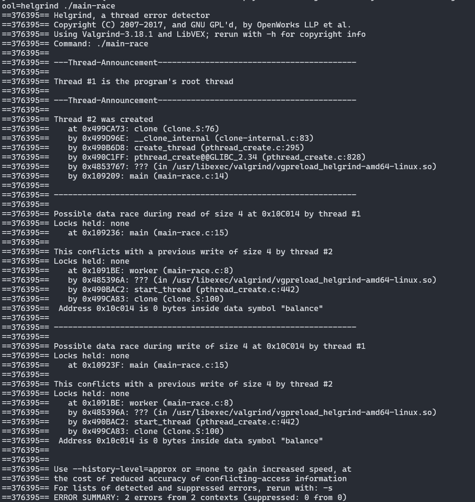
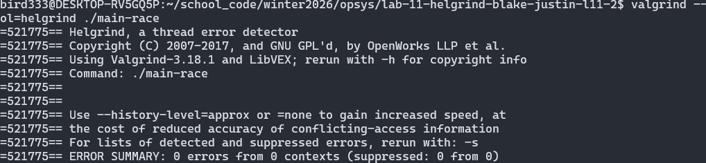
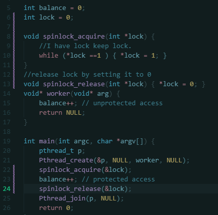
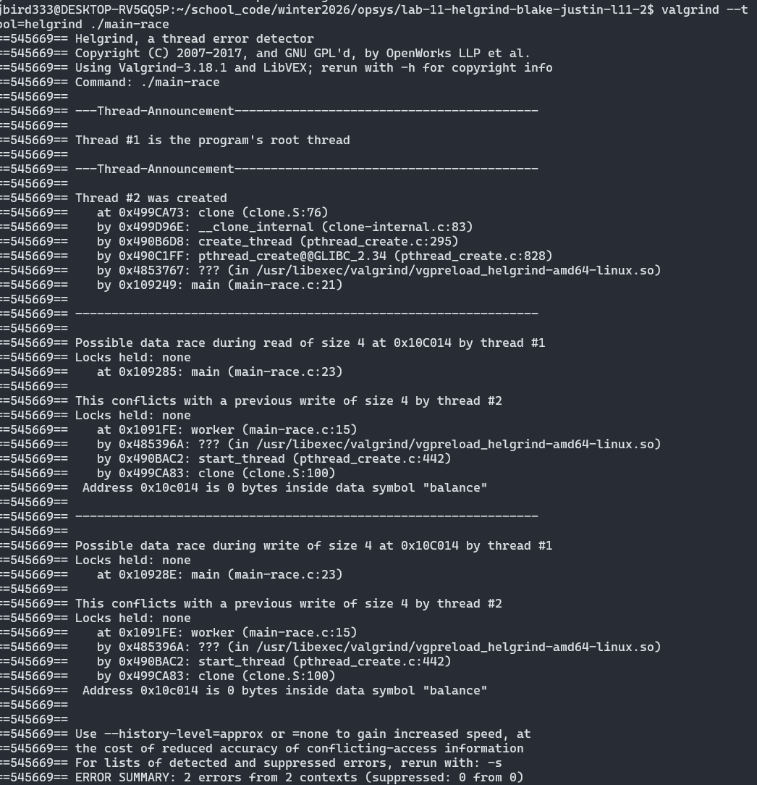
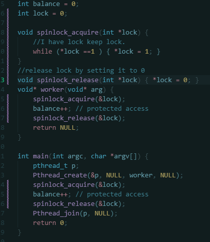
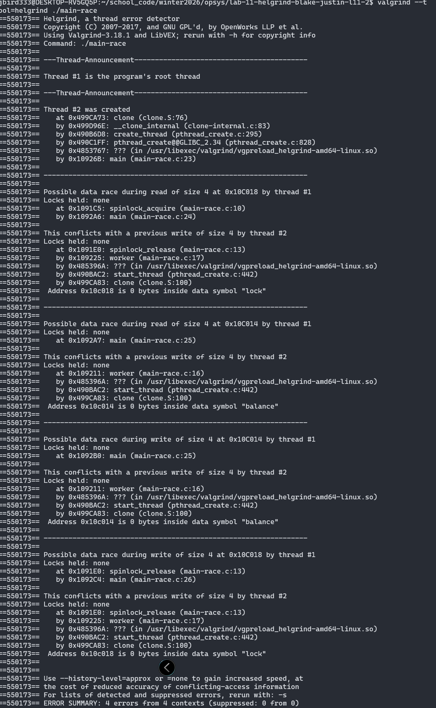

Blake Collins and Justin Birdsall
------------------------------------------------
1. 
First build main-race.c. Examine the code so you can see the (hopefully obvious) data race in the code.
    
    a) Run helgrind (by typing valgrind --tool=helgrind ./main-race) to see how it reports the race.

    b) Does it point to the right lines of code?

    c) What other information does it give to you?

2. 
    
    What happens when you remove (e.g., comment out) one of the offending lines of code?

3. 

    Add a lock around one of the updates to the shared variable. What does helgrind report?

4. 
    
    Now add locks around both. What does helgrind report?

5. 
Examine main-deadlock.c. This code has a problem known as deadlock. Based on this code,

    a) Describe what a deadlock is.

    b) Why specifically does this code have a deadlock?

6. Run helgrind on this code. What does it report?

7. 
Examine main-deadlock-global.c.

    b) Does it have the same problem that main-deadlock.c has?

    c) Why or why not?

    d) Should helgrind be reporting the same error?

    e) What does this tell you about tools like helgrind?

8. 
Look at main-signal.c. This code uses a variable (done) to signal that the child is done and that the parent can now continue. 

    a)Why is this code inefficient?

    b) What does the parent end up spending its time doing, particularly if the child thread takes a long time to complete?

9. 
Run helgrind on this program.

    a) What does it report?

    b) Is the code correct?

10. 
Look at the slightly modified version of the code found in main-signal-cv.c. This version uses a condition variable to do the signaling (and associated lock).

    a) Why is this code preferred to the previous version?

    b) Is it correctness, or performance, or both?

11. 
Once again run helgrind on main-signal-cv.

    Does running helgrind on main-signal-cv report any errors?
-------------------------------------------------
Answers:

1. 
    
    After running helgrind on the main-race program it does point to the correct lines of code, correctly pointing
    out that our threads race towards, incrementing a counter to create new threads. The output shows our second 
    thread is created both thread 1 (our root thread) and thread 2 our sharing the same memory space as thread 1, 
    as thread 2 beats thread 1 to and starts creating thread 442. thread one has no locks and also goes to create 
    a thread 442. This race condition could create possible unintended consequences to our program. 

    Looking at 

2. 

    Commenting out one of the problem of racing towards the incrementor in main removes the race condition.
    the one singular thread increments the counter removing our root racing to change the int. 

3. 

    Helgrind reports that after adding a lock around our previous commented out line that, our program still
    contains a race condition.

4. 

    Adding a second lock around our worker functions incrementor and reports actually double the errors and 
    contexts from 2 to 4. This is due to our locks also not implementing a queuing system. our threads are all 
    dog pilling onto the same lock creating a scenario where multiple threads execute through the lock

5. 

    Examining this code a deadlock is ...

6. 

    Running helgrind on the deadlocked code reported 

7. 

    This code is particuarlly innefecient because... This is hilighted by ...

8.

9.

10. 

    This approach is preferred ...

11. 

    Looking at the output of helgrind on main-singal-cv ... 
